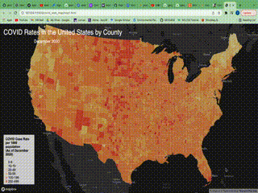

# covid_web_map
This project visualizes COVID pandamic in the U.S. at county level, as of December 2020. We expect our visualizaion to give audiunces a intuitive perception of the pandemic condition, like which part of the country has more patients, which part is more severe by proportion.  
[Map1](map1.html) is a choropleth map visulizing covid rate per 1000 population by U.S. county. [Map2](map2.html) is a proportional symbol map showing the total number of covid cases by county. Both maps use Albers Projection.

## Covid rate map
Map 1 is a choropleth map visulizing covid rate per 1000 population by U.S. county. This map is interactive, just hover the mouse on the county you would like to explore, a pop up box with information of county name and COVID rate will be displayed. Move the cursor away to anohter county, the pop up box with automatically be replaced by another box with info of the current county.

The animation below shows the hovering box of covid cases. You can also browse [Map1](map1.html) to try it yourself!

## Covid case map
Map2 visualizes total number of covid cases by U.S. county. Each dot represent a county. The radius of the dot is proportional to the number of cases of the county, i.e., the larger the dot, more cases the county has. The color is also representative in this regard, the darker the green, more cases it has.

Like the first map, this map is interactive as well, you can click on the dot, and the info box will display the county, the state, and number of COVID cases.
Click [Map2](map2.html) to have a try!

## Acknowledgement
We acknowledged course GEOG 458 @University of Washington for providing the know-how of this project.
#### Data Source
* New York Times
* American Community Survey 2018
* U.S. Census Bureau
#### Languages and libraries we used are listed as below
* CSS
* HTML
* JavaScript
* Mapbox
